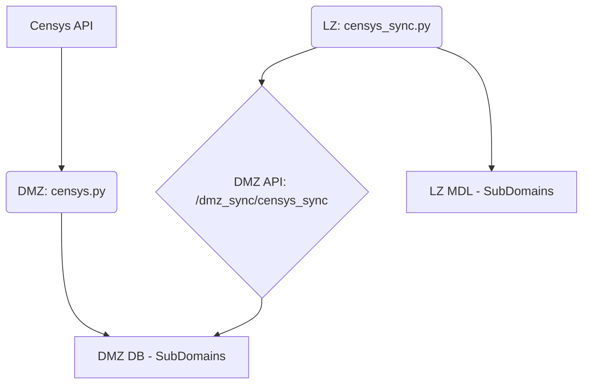
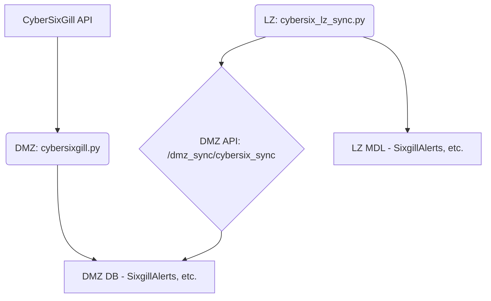
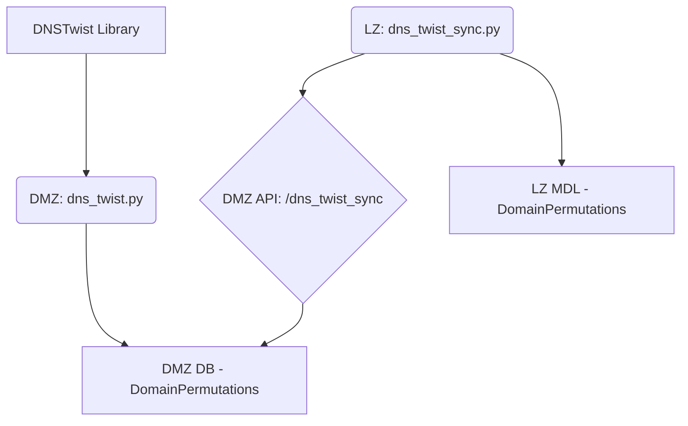
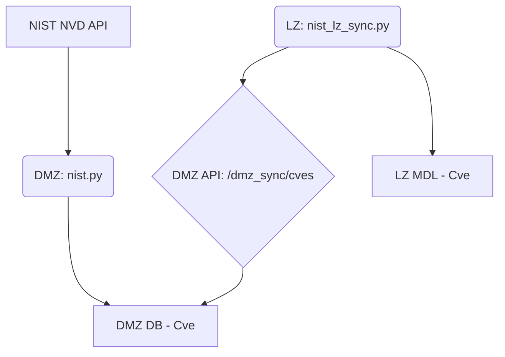
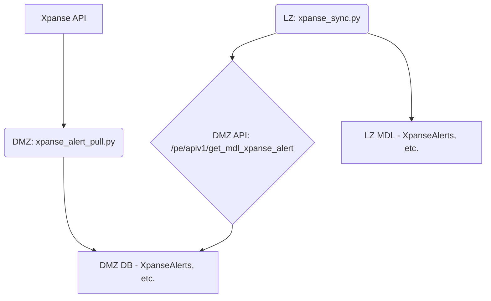
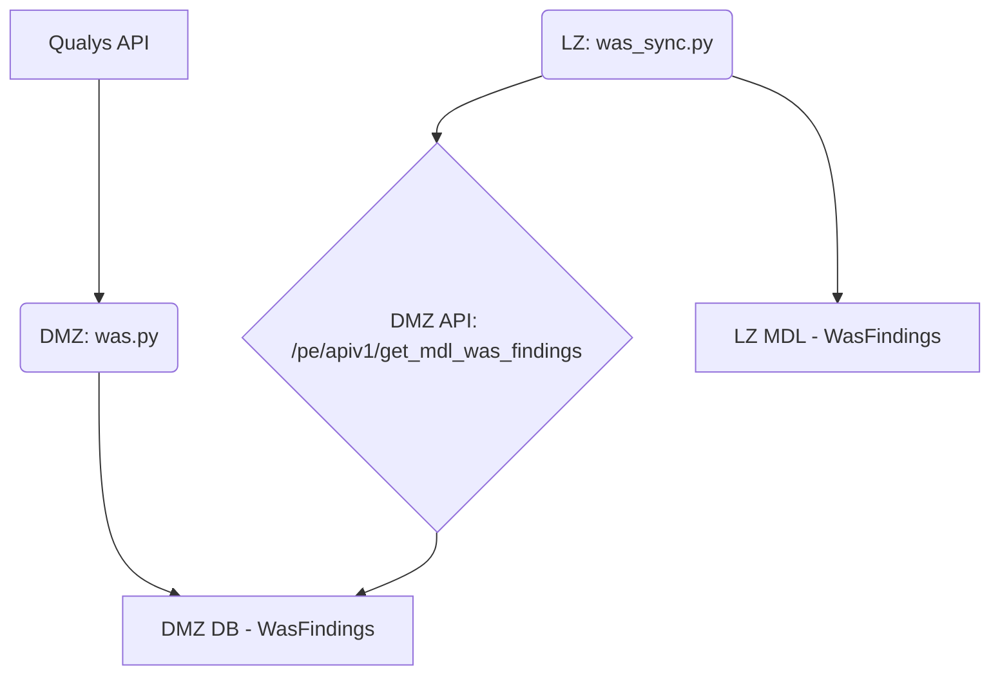
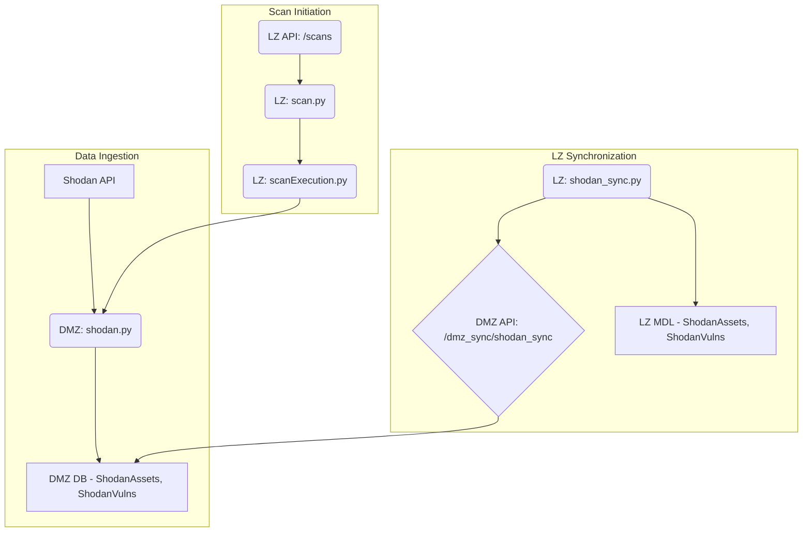
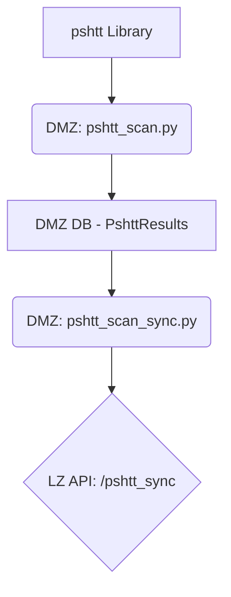
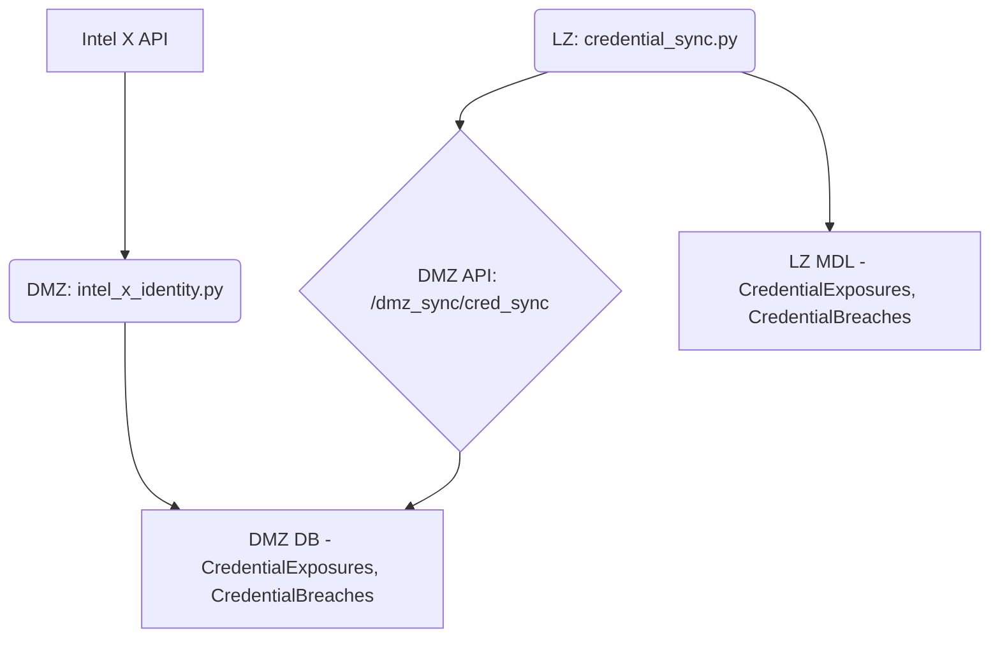
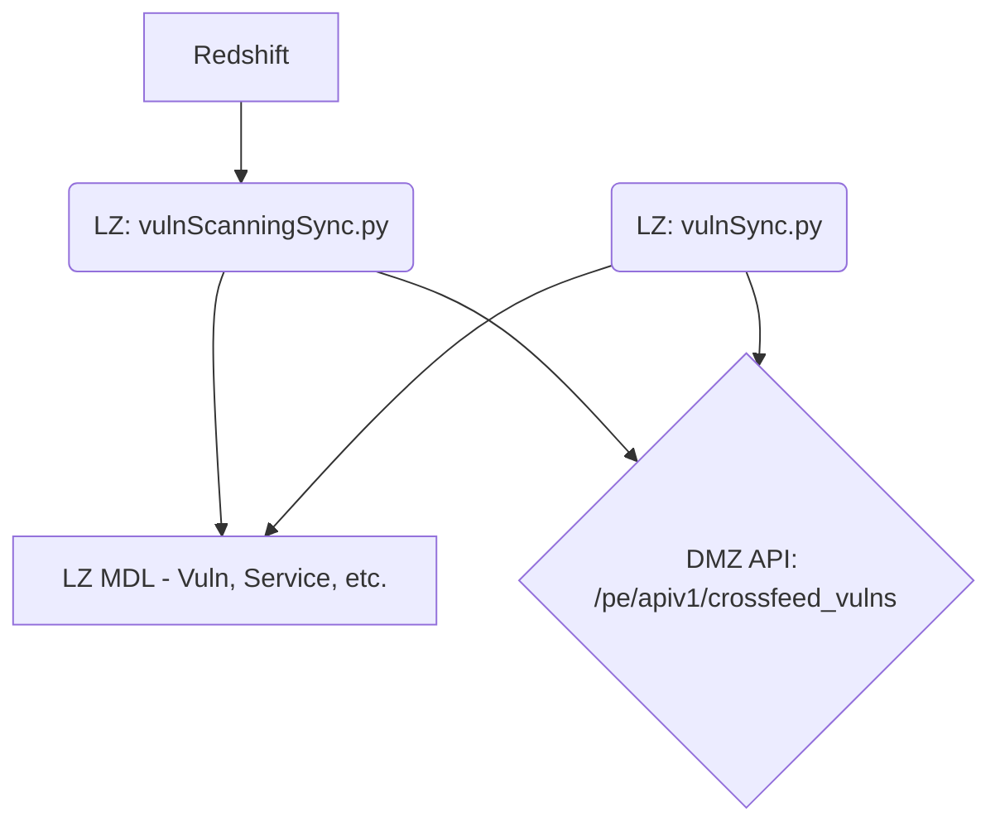

# Data Flow Documentation

## Introduction

This document outlines the data flows for the data sources used in this application.

Our investigation has revealed that the data flow is more complex than initially described. The general pattern is that data is ingested from the external source into a DMZ database, and then a synchronization script running in the LZ pulls this data into the LZ MDL. However, there are some exceptions to this pattern.

The following sections provide a detailed breakdown of the data flow for each data source, including diagrams, scripts, functions, models, and API endpoints.

---

## Censys

### Data Flow Diagram

### Data Flow Breakdown

1.  **DMZ Ingestion**: `backend/src/xfd_django/xfd_api/tasks/censys.py`
    *   This script runs in the DMZ environment.
    *   `handler(command_options)` (L97): Orchestrates the data ingestion process.
        *   Calls `fetch_censys_data(root_domain)` (L128) to pull data from the Censys API.
        *   Saves data to the `SubDomains` model in the DMZ database.

2.  **LZ Synchronization**: `backend/src/xfd_django/xfd_api/tasks/censys_sync.py`
    *   This script runs in the LZ environment.
    *   `handler(command_options)` (L30): Orchestrates the synchronization process.
        *   Calls `query_api("/dmz_sync/censys_sync", ...)` (L59) to fetch data from the DMZ API.
        *   Saves the data to the `SubDomains` model in the LZ MDL.

---

## CyberSixGill

### Data Flow Diagram

### Data Flow Breakdown

1.  **DMZ Ingestion**: `backend/src/xfd_django/xfd_api/tasks/cybersixgill.py`
    *   This script runs in the DMZ environment.
    *   `handler(event)` (L271): Orchestrates the data ingestion process.
        *   Calls `get_alerts()`, `get_mentions()`, etc. to pull data from the CyberSixGill API.
        *   Saves data to the `SixgillAlerts`, `Mentions`, and other related models in the DMZ database.

2.  **LZ Synchronization**: `backend/src/xfd_django/xfd_api/tasks/cybersix_lz_sync.py`
    *   This script runs in the LZ environment.
    *   `handler(event)` (L101): Orchestrates the synchronization process.
        *   Calls `fetch_sixgill_page(...)` (L149) to fetch data from the DMZ API.
        *   Saves the data to the `SixgillAlerts`, `Mentions`, etc. models in the LZ MDL.

---

## DNSTwist

### Data Flow Diagram

### Data Flow Breakdown

1.  **DMZ Ingestion**: `backend/src/xfd_django/xfd_api/tasks/dns_twist.py`
    *   This script runs in the DMZ environment.
    *   `handler(event)` (L351): Orchestrates the data ingestion process.
        *   Uses the `dnstwist` library to generate domain permutations.
        *   Saves the permutations to the `DomainPermutations` model in the DMZ database.

2.  **LZ Synchronization**: `backend/src/xfd_django/xfd_api/tasks/dns_twist_sync.py`
    *   This script runs in the LZ environment.
    *   `handler(event)` (L107): Orchestrates the synchronization of DNSTwist data from the DMZ to the LZ.
        *   The script calls the `/dns_twist_sync` endpoint to retrieve data from the DMZ and saves it to the `DomainPermutations` model in the LZ MDL.

---

## NIST NVD

### Data Flow Diagram

### Data Flow Breakdown

1.  **DMZ Ingestion**: `backend/src/xfd_django/xfd_api/tasks/nist.py`
    *   This script runs in the DMZ environment.
    *   `handler(event)` (L30): Orchestrates the data ingestion process.
        *   Pulls CVE data from the NIST NVD API.
        *   Saves the data to the `Cve` model in the DMZ database.

2.  **LZ Synchronization**: `backend/src/xfd_django/xfd_api/tasks/nist_lz_sync.py`
    *   This script runs in the LZ environment.
    *   `handler(command_options=None)` (L166): Orchestrates the synchronization process.
        *   Fetches CVE data from the DMZ API.
        *   Saves the data to the `Cve` model in the LZ MDL.

---

## Xpanse

### Data Flow Diagram

### Data Flow Breakdown

1.  **DMZ Ingestion**: `backend/src/xfd_django/xfd_api/tasks/xpanse_alert_pull.py`
    *   This script runs in the DMZ environment.
    *   `handler(event)` (L715): Orchestrates the data ingestion process.
        *   Pulls alert data from the Xpanse API.
        *   Saves the data to the `XpanseAlerts` and related models in the DMZ database.

2.  **LZ Synchronization**: `backend/src/xfd_django/xfd_api/tasks/xpanse_sync.py`
    *   This script runs in the LZ environment.
    *   `handler(event)` (L37): Orchestrates the synchronization process.
        *   Fetches Xpanse alert data from the DMZ API.
        *   Saves the data to the `XpanseAlerts` and related models in the LZ MDL.

---

## Qualys WAS

### Data Flow Diagram

### Data Flow Breakdown

1.  **DMZ Ingestion**: `backend/src/xfd_django/xfd_api/tasks/was.py`
    *   This script runs in the DMZ environment.
    *   `handler(event)` (L45): Orchestrates the data ingestion process.
        *   Pulls WAS scan findings from the Qualys API.
        *   Saves the findings to the `WasFindings` model in the DMZ database.

2.  **LZ Synchronization**: `backend/src/xfd_django/xfd_api/tasks/was_sync.py`
    *   This script runs in the LZ environment.
    *   `handler(event)` (L30): Orchestrates the synchronization process.
        *   Fetches WAS findings from the DMZ API.
        *   Saves the findings to the `WasFindings` model in the LZ MDL.

---

## Shodan

### Data Flow Diagram

### Data Flow Breakdown

1.  **Scan Initiation**
    *   `backend/src/xfd_django/xfd_api/api_methods/scan.py`: This script exposes API endpoints for managing scans. When a Shodan scan is initiated through the API, it triggers the scan execution process.
    *   `backend/src/xfd_django/xfd_api/tasks/scanExecution.py`: This script is responsible for executing scans. It starts the required tasks on AWS ECS or a local Docker environment, depending on the configuration. For Shodan scans, it passes the necessary API keys and other parameters to the ingestion script.

2.  **DMZ Ingestion**: `backend/src/xfd_django/xfd_api/tasks/shodan.py`
    *   This script runs in the DMZ environment.
    *   `handler(command_options)` (L20): Orchestrates the data ingestion process.
        *   Pulls host information from the Shodan API.
        *   Saves the data to the `ShodanAssets` and `ShodanVulns` models in the DMZ database.

3.  **LZ Synchronization**: `backend/src/xfd_django/xfd_api/tasks/shodan_sync.py`
    *   This script runs in the LZ environment.
    *   `handler(command_options)` (L40): Orchestrates the synchronization process.
        *   Fetches Shodan data from the DMZ API.
        *   Saves the data to the `ShodanAssets` and `ShodanVulns` models in the LZ MDL.

---

## Pshtt

### Data Flow Diagram

### Data Flow Breakdown

1.  **DMZ Ingestion**: `backend/src/xfd_django/xfd_api/tasks/pshtt_scan.py`
    *   This script runs in the DMZ environment.
    *   `handler(event)` (L11): Orchestrates the data ingestion process.
        *   Calls `main(event)` (L14)
            *   Defined in `backend/src/xfd_django/xfd_api/tasks/pshtt_scan.py` (L26)
            *   Uses the `pshtt` library to scan subdomains.
            *   Saves the results to the `PshttResults` model in the DMZ database.

2.  **DMZ to LZ Push**: `backend/src/xfd_django/xfd_api/tasks/pshtt_scan_sync.py`
    *   This script also runs in the DMZ environment.
    *   `handler(event)` (L23): Orchestrates the synchronization process.
        *   Calls `main(event)` (L26)
            *   Defined in `backend/src/xfd_django/xfd_api/tasks/pshtt_scan_sync.py` (L31)
            *   Reads from the `PshttResults` model in the DMZ database.
            *   Pushes the data to the `/pshtt_sync` endpoint in the LZ.

---

## Intel X

### Data Flow Diagram

### Data Flow Breakdown

1.  **DMZ Ingestion**: `backend/src/xfd_django/xfd_api/tasks/intel_x_identity.py`
    *   This script runs in the DMZ environment.
    *   `handler(command_options)` (L71): Orchestrates the data ingestion process.
        *   Calls `main(command_options)` (L82)
            *   Defined in `backend/src/xfd_django/xfd_api/tasks/intel_x_identity.py` (L91)
            *   Creates an `IntelX` class instance and calls `run_intelx()` (L101)
                *   Defined in `backend/src/xfd_django/xfd_api/tasks/intel_x_identity.py` (L113)
                *   Calls `get_credentials(org)` (L131)
                    *   Defined in `backend/src/xfd_django/xfd_api/tasks/intel_x_identity.py` (L146)
                    *   Pulls credential leak data from the Intel X API.
                    *   Saves the data to the `CredentialExposures` and `CredentialBreaches` models in the DMZ database.

2.  **LZ Synchronization**: `backend/src/xfd_django/xfd_api/tasks/credential_sync.py`
    *   This script runs in the LZ environment.
    *   `handler(command_options)` (L49): Orchestrates the synchronization process.
        *   Calls `main(command_options)` (L60)
            *   Defined in `backend/src/xfd_django/xfd_api/tasks/credential_sync.py` (L69)
            *   Calls `query_api("/dmz_sync/cred_sync", ...)` (L97) to fetch data from the DMZ API.
            *   Saves the data to the `CredentialExposures` and `CredentialBreaches` models in the LZ MDL.

---

## Tenable Nessus

### Data Flow Diagram

### Data Flow Breakdown

1.  **LZ Ingestion from Redshift**: `backend/src/xfd_django/xfd_api/tasks/vulnScanningSync.py`
    *   This script runs in the LZ environment.
    *   `handler(event)` (L86): Orchestrates the data ingestion process.
        *   Fetches vulnerability data from Redshift.
        *   Saves the data to the `Vulnerability`, `Service`, `Domain`, and other related models in the LZ MDL.
        *   Calls `send_organizations_to_dmz()` to push some data to the DMZ.

2.  **LZ Synchronization from DMZ**: `backend/src/xfd_django/xfd_api/tasks/vulnSync.py`
    *   This script also runs in the LZ environment.
    *   `handler(event, context)` (L21): Orchestrates the synchronization process.
        *   Fetches additional vulnerability data from the DMZ API.
        *   Saves the data to the `Vulnerability`, `Service`, and `Domain` models in the LZ MDL.